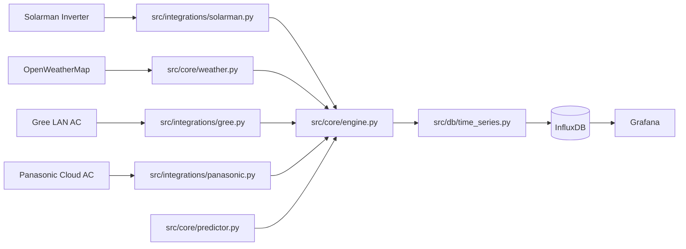

# GRIDLOCK OS

Hybrid solar + battery + HVAC orchestration platform for residential energy optimization.

GRIDLOCK OS continuously reads inverter, weather, and AC state telemetry, predicts battery state-of-charge (SoC) at 17:00, applies safety-aware control logic, and logs a research-grade time-series dataset in InfluxDB.

## Current Status

- Running as Docker services (`gridlock-app`, `influxdb`, `grafana`).
- Cycle heartbeat: every 5 minutes (`src/main.py`).
- Control path: **passive/listen-only** (hard disabled dispatch).
- Gree integration: local LAN polling with retry/backoff/cache/freshness metadata.
- Panasonic integration: currently offline due Comfort Cloud API auth/version response (`401`, code `4106`).
- Inverter telemetry: live Modbus reads with network-partition backoff handling.
- Influx schema: flattened HVAC fields + data quality flags + optional research metrics.

## What The System Does Today

1. Reads inverter telemetry from Solarman/Deye registers.
2. Pulls weather forecast/current conditions from OpenWeatherMap.
3. Predicts SoC at 17:00 via model (if present) or physics heuristic fallback.
4. Computes an AC decision using deterministic policy rules.
5. Syncs AC state from Gree/Panasonic listeners.
6. Applies safety governance:
   - passive guard (no control packets),
   - manual override yield mode (cooldown).
7. Persists all snapshots into InfluxDB (`gridlock_snapshot`).

## Architecture



## Core Modules

- `src/main.py`
  - scheduler loop, one immediate startup cycle, resilient cycle wrapper.

- `src/core/engine.py`
  - policy engine, clipping/heatwave checks, passive guard, manual override cooldown, snapshot write orchestration.

- `src/core/predictor.py`
  - model-first prediction (`joblib`) with deterministic physics fallback.

- `src/core/weather.py`
  - forecast slot selection near 17:00 + current weather + theoretical PV potential estimator.

- `src/integrations/solarman.py`
  - local Modbus telemetry (SoC/PV/load), partition backoff, optional research register reads.

- `src/integrations/gree.py`
  - local Gree state read, retries, exponential backoff, cache fallback, health metadata.

- `src/integrations/panasonic.py`
  - Panasonic Comfort Cloud read wrapper.

- `src/db/time_series.py`
  - single Influx write surface, flattened fields, quality flags, retry-on-write-failure.

## Safety and Reliability Features

### Passive Guard (No Command Dispatch)

- `PASSIVE_AC_LISTEN_ONLY = True` in `src/core/engine.py`.
- Engine still computes decisions, but dispatch is intentionally blocked.

### Human-In-The-Loop Yield Mode

- If observed Gree state is `OFF` while AI desired command is `ON`, system enters cooldown.
- Cooldown duration: 60 minutes (`MANUAL_OVERRIDE_COOLDOWN_MINUTES`).
- Effective command is forced `OFF` during cooldown.

### Gree Connection Health

- Connection state field: `gree_connection_state` = `live` | `degraded` | `offline`.
- Tracks last live timestamp and connect failure count.
- Uses in-memory cache, disk cache (`/tmp/gridlock_gree_last_state.json`), and Influx bootstrap cache fallback.
- Periodic fresh probing even while cached.

### Inverter Network Partition Handling

- Detects `NoSocketAvailableError` / `Errno 101`.
- Applies reconnect gate with backoff (`30s`) before retrying client init.
- Returns zero telemetry while partition backoff is active.

### Data Quality Guardrails

- Gree stale quality fields persisted:
  - `gree_state_fresh`
  - `gree_stale_seconds`
  - `gree_connect_failures`
  - `gree_stale`
- When stale, flattened Gree feature values are skipped to protect ML training quality.

## Influx Measurement and Field Model

Measurement: `gridlock_snapshot`

### Energy + Decision Fields

- `battery_soc`
- `cloud_cover`
- `outside_temp_c`
- `ac_power`
- `ac_temp_setpoint`
- `predicted_soc_at_1700`
- `pv_yield_kw`
- `load_kw`
- `theoretical_pv_potential`
- `is_clipping`
- `solar_health_score`
- `forecast_max_temp_3d`

### Optional Research-Grade Inverter Fields

- `ac_output_power_kw`
- `daily_pv_energy_kwh`
- `daily_load_energy_kwh`
- `total_energy_kwh`
- `inverter_efficiency`

These are only populated when corresponding register IDs are configured.

### AC State Fields

Raw JSON snapshots:
- `ac_gree_state`
- `ac_panasonic_state`

Flattened HVAC fields:
- `gree_power`
- `gree_temp_target`
- `gree_temp_actual`
- `gree_fan_speed`
- `panasonic_power`
- `panasonic_temp_target`
- `panasonic_temp_actual`
- `panasonic_fan_speed`

Quality fields:
- `gree_state_fresh`
- `gree_stale_seconds`
- `gree_connect_failures`
- `gree_stale`

## Environment Configuration

Primary runtime config is in `.env` and loaded by `src/config.py`.

### Required

- `OWM_API_KEY`
- `INVERTER_IP`
- `INVERTER_SERIAL`
- `INFLUXDB_TOKEN`

### Common Optional

- `MODEL_PATH`
- `DRY_RUN`
- `PV_ARRAY_CAPACITY_KW`

### Optional Research Register Mapping

Leave blank until register map is verified:

- `INVERTER_REG_AC_OUTPUT_POWER_W`
- `INVERTER_REG_DAILY_PV_ENERGY_KWH`
- `INVERTER_REG_DAILY_LOAD_ENERGY_KWH`
- `INVERTER_REG_TOTAL_ENERGY_KWH`
- `INVERTER_AC_OUTPUT_POWER_SCALE`
- `INVERTER_DAILY_PV_ENERGY_SCALE`
- `INVERTER_DAILY_LOAD_ENERGY_SCALE`
- `INVERTER_TOTAL_ENERGY_SCALE`

## Runbook

### Start

```bash
docker compose up -d --force-recreate
```

### Check app logs

```bash
docker compose logs -f --tail 120 gridlock-app
```

### Check services

```bash
docker compose ps
```

## Known Issues

- Panasonic listener currently fails with:
  - HTTP `401`
  - response code `4106` (`New version app has been published`)
- Gree can intermittently timeout on direct standalone probe scripts; engine path now handles this better with backoff + cache logic.
- Research-grade energy counters are wired but remain `None` until verified register mapping is provided.

## Research Objective and Roadmap

### Completed Foundation (Current)

- Stable telemetry pipeline (inverter + weather + AC state).
- Resilient hardware integration with retries/backoff/fallbacks.
- Passive-safe operation mode for controlled bake period.
- Clean timeseries schema suitable for forecasting and optimization research.

### Next Milestones

1. Register verification for daily/lifetime energy counters.
2. Grafana dashboards for quality and health metrics.
3. A/B baseline reports from bake dataset.
4. Day-15 planner integration (hybrid architecture):
   - XGBoost forecast layer,
   - finite-horizon planner (A* / dynamic programming over SoC state trajectory),
   - CSP safety constraints (comfort, minimum battery reserve, override lockout).
5. Closed-loop optimization evaluation:
   - cost reduction,
   - self-consumption increase,
   - SoC reliability and comfort stability.

## Suggested Day-15 Planner Interface (Target)

- Keep `engine.py` as execution/safety authority.
- Add planner module that outputs an hourly command trajectory.
- Engine validates and enforces:
  - manual override cooldown,
  - battery floor constraints,
  - stale telemetry guards.

## Utilities

- `find_my_gree.py`
  - UDP broadcast scanner helper for local Gree discovery.

- `src/utils/provision_gree.py`
  - one-time Gree discovery/bind helper using `greeclimate` APIs.

## Security Notes

- `.env` is ignored by git and must never be committed.
- Rotate any GitHub token that has ever been shared in logs/chat.
- Keep all cloud API credentials scoped and revocable.

## License

No license file is currently present. Add a project license before public distribution.
